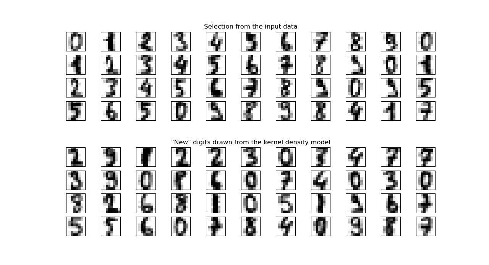

# ReversibleTSNE: An Extension for Inverse t-SNE Transformations

The **ReversibleTSNE** is designed to augment the capabilities of `sklearn's` t-SNE by introducing a method to calculate an inverse transform. This enables mapping from the embedded space back to the original data space.

## Understanding the Inverse Transform Challenge with t-SNE

Traditionally, t-SNE doesn't support an inverse transformation. The main reasons for this limitation include:

- The cost function for t-SNE is non-convex.
- There isn't a direct analytic approach to derive an inverse for t-SNE.
- Due to its non-convex nature, the inverse mapping may not always exist or be uniquely defined.

Given these challenges, a direct solution isn't possible. However, by leveraging computational methods like Machine Learning and Global Optimization, we can approximate this elusive inverse transformation.

### Approaching the Inverse Transform

#### 1. Machine Learning

In our **ReversibleTSNE** repository, we utilize Machine Learning techniques to learn this inverse mapping. The general idea is to:

1. **Train a Model**: Use the t-SNE embeddings as input and original data as output to train a regression model.
   
   **Equation**:
   \[
   f_{\text{ML}}(y) \approx x
   \]
   
   where \( y \) is the t-SNE embedding and \( x \) is the original data.

2. **Predict**: Once trained, this model can predict the original data from any given t-SNE embedding, thus serving as an approximate inverse.

#### 2. Global Optimization

Although Machine Learning provides a feasible solution, another method is to use Global Optimization. This method searches for a solution that minimizes the difference between the original data and the inverse transformed data.

**Equation**:
\[
\text{argmin}_{x'} || x' - f_{\text{TSNE}}^{-1}(y) ||_2
\]

where \( f_{\text{TSNE}}^{-1}(y) \) represents the inverse t-SNE mapping.

However, this method has its challenges:

- **Computational Cost**: It's much more computationally intensive than the Machine Learning approach.
- **Scalability**: If the dimensionality of the original dataset is too large, the Global Optimization method can quickly become impractical.

## Why Use Machine Learning for the Inverse Transform in our Repository?

Given the relative ease, efficiency, and the scalability of the Machine Learning approach, our **ReversibleTSNE** primarily uses this method to approximate the inverse mapping. It offers a good balance between accuracy and computational feasibility, especially when dealing with high-dimensional datasets.

By doing so, users can not only visualize data in reduced dimensions but also have a way to trace back to the original space, providing a much-needed bridge between data visualization and interpretation.

### Usage

Code is written for compatibility with sklearn API, the only difference is that a subset of the original data is required for producing the inverse mapping.  Ideally, this subset should include varried samples from the original data. It is possible to completely remove this requirement and train a ML model in the fit method (this is seen as a future improvement).

### Performance

Reversing the mapping requires training a multi-output regression model, in addition to the t-SNE model and hence this process is slower than PCA/Kernel-PCA. However if the application requires very aggressive dimensionality reduction (hence aggressive compression), the output quality of this method is better than PCA / Kernel-PCA. Currently the "exact" method of t-SNE in sklearn is very slow, hence the n_components of t-SNE is limited in this case to 3 with the "barnes_hut" method.

### Examples

Some examples of how to use this method are in

- ```plot_digits_denoising.py```
- ```plot_digits_kde_sampling.py```

both of which are adapted from sklearn eamples.

### Sample Results

**KDE SAMPLING**


